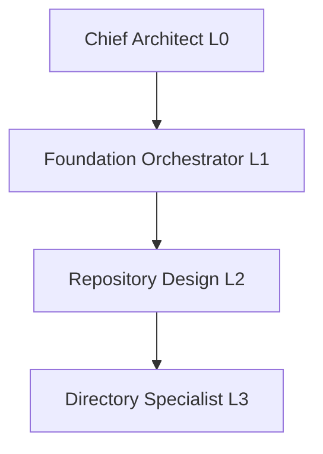

# Agent Hierarchy Diagram Skill

Generate visual diagrams of agent hierarchy.

## When to Use

- Documenting agent system
- Understanding delegation structure
- Onboarding new contributors
- Visualizing agent relationships

## Usage

```bash
# Generate ASCII diagram
./scripts/generate_hierarchy_diagram.sh

# Output to file
./scripts/generate_hierarchy_diagram.sh > agents/hierarchy-visual.txt

# Generate mermaid diagram
./scripts/generate_mermaid_diagram.sh > agents/hierarchy.mmd
```

## Diagram Format

```text
Chief Architect (L0)
├── Foundation Orchestrator (L1)
│   ├── Repository Design (L2)
│   │   ├── Directory Specialist (L3)
│   │   │   └── Junior Engineer (L4)
│   │   └── Config Specialist (L3)
│   └── Config Design (L2)
├── Shared Library Orchestrator (L1)
│   └── Tensor Module Design (L2)
│       └── Tensor Specialist (L3)
└── ...
```

## Mermaid Format



## Use Cases

- Add to `/agents/hierarchy.md`
- Include in documentation
- Presentation materials
- Understanding delegation

See `/agents/hierarchy.md` for existing diagram.
